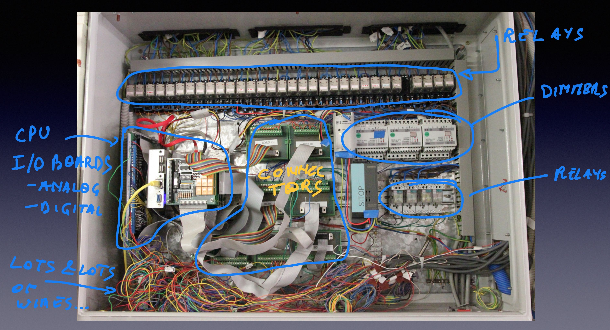
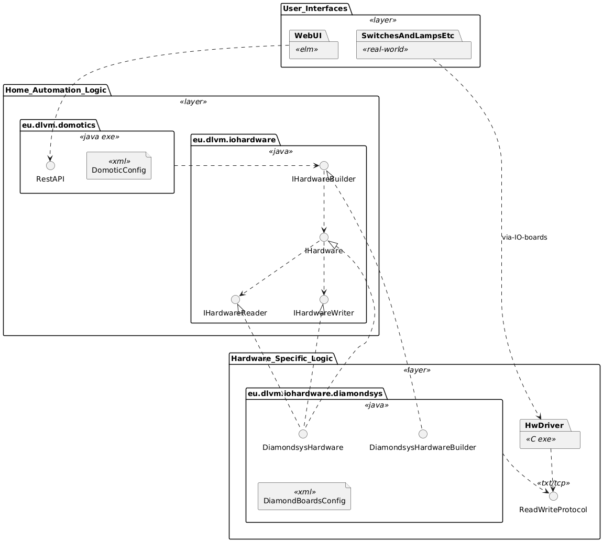
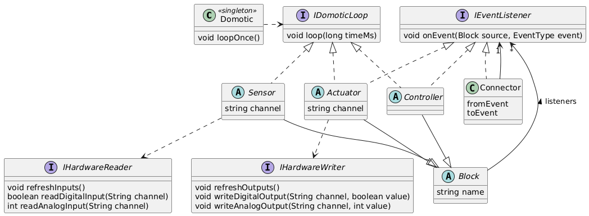
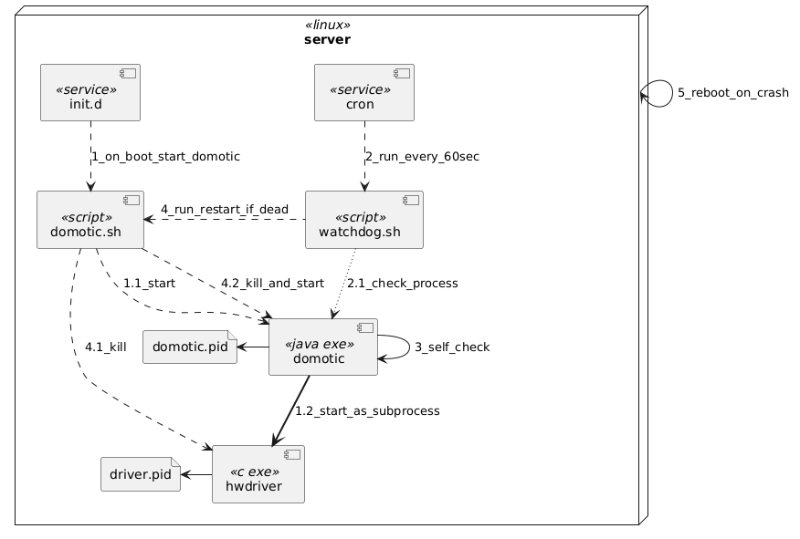

<span style="font-family:Arial; font-size:3em;">DIY Home Automation<br/>Software Architecture Document</span>

> author: dirk@dlvmechanografie.eu<br/>date: 12/6/2022 (eu)


**Table of Contents**
- [1. Introduction](#1-introduction)
- [2. Context](#2-context)
- [3. Architectural Drivers (aka Architectural Significant Requirements)](#3-architectural-drivers-aka-architectural-significant-requirements)
- [4. Solution Architecture](#4-solution-architecture)
  - [4.1. Functional View](#41-functional-view)
    - [4.1.1. Model](#411-model)
    - [4.1.2. Interfaces](#412-interfaces)
    - [4.1.3. Rationale and Alternatives](#413-rationale-and-alternatives)
  - [4.2. Deployment View](#42-deployment-view)
    - [4.2.1. Model](#421-model)
    - [4.2.2. Rationale and Alternatives](#422-rationale-and-alternatives)
  - [4.3. Development View - Layers](#43-development-view---layers)
    - [4.3.1. Model](#431-model)
    - [4.3.2. Rationale and Alternatives](#432-rationale-and-alternatives)
  - [4.4. Development View - Modules on Configuration and Execution](#44-development-view---modules-on-configuration-and-execution)
    - [4.4.1. Model](#441-model)
    - [4.4.2. Simple Example](#442-simple-example)
    - [4.4.3. Rationale and Alternatives](#443-rationale-and-alternatives)
  - [4.5. Availability \& Reliability Perspective](#45-availability--reliability-perspective)
    - [4.5.1.  Fault Detection \& Restart Model](#451--fault-detection--restart-model)
    - [4.5.2. Availability Calculation Model](#452-availability-calculation-model)
    - [4.5.3. Rationale and Alternatives](#453-rationale-and-alternatives)
- [5. Architectural Evaluation \& Risks](#5-architectural-evaluation--risks)
  - [5.1. Evaluation](#51-evaluation)
  - [5.2. Risks \& Mitigation](#52-risks--mitigation)
  - [5.3. Missing Views / Future Work](#53-missing-views--future-work)
- [6. End of Document](#6-end-of-document)

# 1. Introduction

This document describes the context, architectural drivers and design of the home automation system.

Its purpose is to:
- List the main requirements that drive the architecture.
- Explain the structure of the system without having to dive in thousands of lines of code. Great for newbees, as well to the author who tends to forget stuff easily.
- Evaluate if and how the design realizes the requirements (drivers), and any alternatives considered.


# 2. Context

The system is a **Home Automation** system built up from common hardware and custom software. 

The system only handles lights and sun screens, not wall sockets or heating or other fancy stuff. 

The primary goal of this system is for me, as a software engineer, to keep my skills up to date, have some fun and sometimes help convince recruiters to hire me ;-) There are much more feature rich open-source systems available elsewhere.

Here is a view of the hardware I currently use.


At the bottom is an Advantech Atom CPU based motherboard, on top of which stack multiple I/O boards from Diamond Systems. The I/O boards provide digital and analog inputs and outputs, which connect to switches, lamps, screens, fans, voltage controlled dimmers or a weather station that measures wind and light.

This hardware is connected to many many wires, relays, dimmers, power supplies in below closet.


At the far left, left from the CPU and stacked I/O boards, there is an extra PCB with extra buffers and analog in/out amplifiers. Reason is that this was cheaper than buying extra Diamond Boards.

Finally, we have two Human User Interfaces:
1. the main one being wall switches, lamps and so on, and 
2. a web based UI shown below.
<div>

</div>
Some historical evolutions (and more photos) are in [History](./HISTORY.md).


# 3. Architectural Drivers (aka Architectural Significant Requirements)

This lists these home automation requirements that drive the design.

| ID | Category | Driver | 
| -- | --- | --- |
| Layout Config | Configurability | Layout Configurability: Easy to configure when sensors or actuators are added, removed or changed. For example, assigning a switch to another lamp, changing name of a lamp, change the sun sensitivity for automatic screens, change when lights outside go on and off automatically. |
| UI Config | Configurable | A UI that is generated from the configuration. So no coding work whenever the configuration (see 1) changes. |
| BugFree | Reliability | Since I'm sometimes traveling and my wife or children lack knowledge on the system, it must have no bugs. |
| Safe | Safety | Software must not destroy, short-circuit or overheat hardware like screen motors or lamps. Additional safeguards must avoid this. |
| Available | Availability | 99,99% uptime over 1 week, so 1.01 unavailability minutes a week. |
| HwChange | Flexibility | Other hardware could be chosen than the current one, and that should have max. 1 man-month work impact. |
| Explore | Flexibility | A test-bed for new software technologies and a showcase. So some degree of over-engineering is allowed ;-) |


# 4. Solution Architecture

## 4.1. Functional View

### 4.1.1. Model 

Legend for below model diagram:
- rectangle: **component**; a runnable software component, except for `switches_lamps_etc` which is hardware
- arrow: **connector**; communication between components and/or interfaces; arrow direction is from communication-initiator to target
- lollipop: **interface**; optional, explicit interface offered by the component it has a line too


Description of the different components, interfaces and connectors:

| element | description |
|---|---|
| switches_lamps_etc | The classical Human User Interface being switches, light & wind sensors, lamps, screens etc. |
| webapp | [ELM](https://elm-lang.org) based UI based WebApp HMI. One could say this is the secondary user-interface, besides the mechanical switches. |
| domotic | Java program that contains all the logic of the domotic system. It has an embedded Jetty HTTP server, see [ServiceServer](../src/main/java/eu/dlvm/domotics/server/ServiceServer.java). |
| IStatic | HTTP endpoint to serve static content, specifically the `webapp` front-end. It listens on the root path, e.g. `http://localhost/`. |
| RestAPI | REST API offered by `domotic`, to read domotic state as well as update it. See [RestService](./src/main/java/eu/dlvm/domotics/service/RestService.java) for details. It listens on the `rest` paths, e.g. `http://localhost/rest/`. **Needs rework!** |
| IUiCapableBlock | Websocket connection, sends each state update (lamp, wind, light sensor etc) to registered websocket clients. It is a list of [IUiCapableBlock](../src/main/java/eu/dlvm/domotics/base/IUiCapableBlock.java) informations sent at each state change. |
| OpenWeatherApi | Interface from OpenWeather to get information like sunset and sunrise. URL used is http://api.openweathermap.org/data/2.5/weather?q=Leuven,be&appid=... |
| hwdriver | C program that talks to the IO boards that in turn connect with switches, lamps etc. This is a very thin component, only executing the simple read/write commands it gets from `domotic` via `HardwareIO` interface onto the `IO Boards` hardware. <br/>Note that this program is Diamond Systems specific.|
| HardwareIO | Custom protocol to read inputs (switches, light sensort etc.) from the IO boards, and write outputs to the IO boards to control lamps, screens, dimmers etc. It is a custom protocol - specific for Diamonds IO boards - that is text based and uses TCP/IP. |
| IO_board | IO Boards from Diamond System Corporation, compatible with PC/104 standard. IO Boards - multiple - have numerous digital inputs and outputs as well as a few analog inputs and outputs. Reading and writing IO goes via direct memory access (hence the supervisor mode of `hwdriver`) according to DMATT protocol. This is detailed in Diamond Systems documentation.<br/>Between the IO Boards and the switches, lamps (via relais or voltage-controlled dimmer) etc. is pure electricity based. | 


### 4.1.2. Interfaces
_Only fragments shown here, just to get the idea._

The interface `RestAPI` gives the current status of all actuators (output devices), and you can change some input. Below is an example of a lamp, when calling `http://hostname/rest/statuses`.
```json
[
    {
        "name": "LichtKeuken",
        "type": "Lamp",
        "description": "Keuken",
        "groupName": "Beneden",
        "groupSeq": 0,
        "status": "OFF",
        "on": false
    }
]
```

For the interface between `domotic` and `hwdriver`, the Diamondsys specific `eu.dlvm.iohardware.diamondsys.messaging.HardwareIO` uses text messages over TCP. For example when `domotic` receives the message `INP_D 0x300 6 - 240`
means that for the board at address 0x300:
- `6`:  digital input channels 1 and 2 are on hence 6, since 110 in binary
- `-`: value of analog channel 0 was not requested, and 
- `240`: analog channel 1 measures 240.

 
### 4.1.3. Rationale and Alternatives

All 'business' functionality is present in the java program `domotic`. It reads the configuration at startup and drives or supports all other components.

The `hwdriver` is a separate executable. It needs to communicate with the IO boards, which requires direct memory addressing, something that is not possible with Java. Therefore it was written in C. It is kept as small as possible though, only forwarding commands between `domotic` and the `IO Boards`. 

Originally there was no `webapp`, only the usual wall switches etc. An earlier simpler version was written with JQuery and Javascript, but this was really ugly code, difficult to maintain and understand, let alone to extend. Thanks to Frank P. I learned about [ELM](https://elm-lang.org), a pure functional language (subset of Haskell + functional reactive) and pure fun.

## 4.2. Deployment View

### 4.2.1. Model

Legend for below model diagram, which is based on UML:
- cube: **node**; computer or device
- rectangle: **component**; a runnable software component, except for `switches_lamps_etc` which is hardware
- note: **file**; configuration or other key files
- full line: **connector**; communication between components or nodes
- dashed line: **usage**; component writes and/or reads that file


Description of the different nodes and components is in below table. Elements already explained earlier are left out.

|element | description |
|---|---|
| server | Ubuntu Linux on an Advantech Atom PC, with PC/104 IO Boards from Diamond Systems. |
| PC_or_mobile | Client device such as personal computer or tablet or smartphone. Must be on the home network, e.g. `192.168.*.*` |
| browser | Any web browser, but currently only tested with Safari. |
| DomoticConfig | Defines all inputs, outputs and behaviours of the home automation system. Switches, Lamps, Screens etc., and how the are connected and configured.<br/>It also defines the layout in the UI.|
| DiamondBoardsConfig | Defines how the hardware is configured. See Layered View later, this allows for different hardware to be used without touching the domotic specific code. |
| logs | Both `domotic` and `hwdriver` send logs to this folder. They use `logback` and `log4c` respectively.
| domotic.pid | File containing the PID of the `domotic` program. Used for restarting. |
| driver.pid | File containing the PID of the `hwdriver` program. Used for restarting. |
| DomoticOutputStates.txt | File containing the actual states of the output devices, e.g. whether a certain lamp is on or off. Used when restarting to restore the old state. |


More information is on service definitions and startup / health-check-restart is in the _Availability View_.

### 4.2.2. Rationale and Alternatives

The Advantech CPU board may seem overdimensioned for what is needed, but:
1. The "Exploration" requirements asks for overdimensioning, since the idea was (is) to add more new technologies and processes to it later on. As time passed other services might be offloaded to cloud or other servers, so this is no longer true. On the other hand at the time of writing (2022) this hardware is more than 10 years old.
2. This is not a commercial product to be sold in the 1000s, so productivity on functionality was more important than keeping the cost of hardware as low as possible.

It is perfectly possible to have `domotic` and `hwdriver` run on different computers. This can make development easier as `domotic` runs on a Mac with full IDE and the `hwdriver` runs on the `Atom CPU board`.


## 4.3. Development View - Layers

### 4.3.1. Model 

There are 3 major layers:
1. User Interfaces - Both the Web App and the physical switches / lamps etc.
2. Home Automation Logic - All Java classes that contains all functional logic and that has the `main()` routine. It is hardware independent. It also defines a collection of interfaces, itself hardware independent, that hardware-dependent logic has to implement 
3. Hardware Specific Logic - When another hardware platform is used than today's Diamond Systems I/O boards then only this layer should be replaced, and the upper two layers not.

Below figure shows these layers and some of the modules relevant to the layers. 

Legend: follows UML Class Diagrams, with these specifics:
- &lt;&lt;layer&gt;&gt; - Package defining a layer.
- &lt;&lt;exe&gt;&gt; - Executable, basically contains a `main()` routine.



| element | description |
|---|---|
| eu.dlvm.domotics |  Main java program, the executable. All logic is hardware independent. It offers all its functionality, including UI specific information, via `RestAPI`. The actual configuration of switches, lamps, timers, dimmers etc. and how they should behave is defined in a hardware independent way in `DomoticConfig` XML file. |
| eu.dlvm.iohardware | Imposes a generic interface onto hardware specific logic. Note that these interfaces are still part of the hardware-independent layer. <br/> Interface `IHardware` has an operation to start and stop the hardware, and includes getters for interfaces `IHardwareReader` and `IHardwareWriter` to read inputs and write outputs respectively.<br/> Interface `IHardwareBuilder` is used at initialization to get an instance of `IHardware`. |
| eu.dlvm.iohardware.diamondsys | Java classes `DiamondsysHardware` and `DiamondsysHardwareBuilder` realize the interfaces from `eu.dlvm.iohardware` for Diamond Systems specific boards. It also has an XML configuration file `DiamondBoardsConfig` that links the generic I/O addresses used in the higher layer to specific boards (via memory address) and board-specific input or output numbers.|
| ReadWriteProtocol | This is a description of the text based and TCP/IP based protocol to communicate between the Java code and the HwDriver. It is specified as comments in specific `eu.dlvm.iohardware.diamondsys` classes and in the `HwDriver` code. |
| HwDriver | C based program. See higher for its description. |


### 4.3.2. Rationale and Alternatives

This view addresses the HwLayout and UiLayout architectural drivers listed in chapter 3. The softwares in package `Home Automation Logic` have all the business functionality, including the configuration - via `DomoticConfig.xml` - for both webapp UI and the home sensors and actuators layout and functionality.

>Note: UI configuration is not covered yet in this document.

For the hardware, let's follow a scenario. 

Suppose another hardware is used than Diamond Systems, what needs to change?
1. Another Java implementation of the interfaces in `eu.dlvm.iohardware`.
2. Depending on the hardware and its driver, another `HwDriver` is needed or perhaps another solution (who knows, that hardware might include a Java driver).
3. Another configuration means replacing `DiamondBoardsConfig`,

That should be it. Often a new kind of hardware might impact the interfaces in `eu.dlvm.iohardware` making them more generic so that they can handle more different types of hardware. But today's separation  should already make this more easy.


## 4.4. Development View - Modules on Configuration and Execution

### 4.4.1. Model
The main classes related to a specific configuration of a home automation system, and how it is executed, are depicted below.

> Note: it may be instructive to read this model together - back and forth - with the example following this chapter.

Legend: classical UML Class diagram representing Java classes and interfaces.



| element | description |
|---|---|
| Block | Supertype that just has a unique name and is the supertype of the main elements of a Home Automation system.<br/>Blocks typically hold state. A Lamp - an Actuator - must know whether it is currently on or off, so that it knows what do do when a `Toggle` event is received. A Switch - a Sensor - only knows if it is a `Single Click`, `Double Click` or `Long Click` after it measured the times between input going up (button pressed) and input going down (button released). So state and times - see `loop(currentTime)` - are essential. |
| Sensor | Sensors sense input from hardware, they read digital and analog input values. Examples are Switches, Wind Meter, Sun Meter.<br/>They have at least one input channel, sometimes more. <br/>They transform simple hardware inputs into higher level events, such as DoubleClick or SingleClick or WindHigh.<br/> Only Sensors can read data from hardware. <br/>Sensors send events to Controllers or directly to Actuators.| 
| Actuator | Actuators actuate output, they set digital or analog output values. Examples are Lamps, Fans, Screen Motors.<br/>They have at least one output channel like a switch, or multiple like up/down for screens. <br/>Only Actuators can change outputs of hardware. <br/> Actuators do not send events to other Blocks.
| Controller | Controller typically contain functionally complex logic. Examples include Sun-Wind Controller, Timers, Anti Burglary feature.<br/>Controllers have no access to hardware.<br/>Controllers send events to  Actuators or other Controllers. |
| IEventListener | Blocks can send events to other Blocks, e.g. when a Switch is pressed (Sensor) it sends an event to a Lamp (Actuator) so it is switched on or off.|
| Connector | Used between Blocks to convert one event-type into another. Is fully stateless - contrary to `Block`s - and very lightweight. <br/>E.g. in earlier Switch/Lamp example a Switch sends `SingleClicked` events and Lamps expect `Toggle` events. So a `Connector` is placed in between to convert this event.
| Domotic | Singleton class implementing the `loopOnce()` function explained below this table. Essentially it evaluates all inputs, logic and outputs every 20 milliseconds (default parameter). |
| IDomoticLoop | All Blocks implement the `loop()` function called from `loopOnce()` in a specific order - see details below this table. State changes of a Block, like 'on' or 'off' in an Actuator, must only occur from within a `loop()` function (not from an event). |
| IHardwareReader IHardwareWriter | Hardware independent abstracitons for hardware inputs and outputs respectviely. `Sensors` can only use `IHardwareReader` and `Actuators` can only use `IHardwareWriter`. |


The `loopOnce(long currentTime)` function drives the home automation:

```java
	public synchronized void loopOnce(long currentTime) {
		hw.refreshInputs();
		for (Sensor s : sensors) {
			s.loop(currentTime);
		}
		for (Controller c : controllers) {
			c.loop(currentTime);
		}
		for (Actuator a : actuators) {
			a.loop(currentTime);
		}
		hw.refreshOutputs();
	}

```

This is what happens every 20 ms (default, configurable):

- `IHardwareReader.refreshInputs()` is called, so that all actual hardware inputs are read and buffered. _Under the hood this sends a set of commands to `HwDriver` to read the values from the `IO Boards`._
- All Sensors have their `Sensor.loop()` executed to process these inputs via `IHardwareReader` and update their state machines if appropriate. State changes may lead to events being sent to Controllers or Actuators. These Controllers and Actuators **must not yet evaluate this change, they must not yet change their state or send events elsewhere themselves** - they just have to 'remember' the event received.
- Next `Controller.loop()` is run on all Controllers. Now it is the time to process any event information received and remembered. This may lead to a state change of the Controller itself, which in turn may lead to an event to another Controller or Actuator. Again, receivers of these events just note down the information sent by the event - they must not yet act upon it.
- Finally Actuators have their `Actuator.loop()` executed, so they can update state and if applicable update hardware outputs. When output hardware needs to be updated an Actuator uses `IHardwareWriter` that buffers the output changes.
- To actually update hardware output `IHardwareWriter.refreshOutputs()` is called.

This may all be very abstract, below example may be helpful.

### 4.4.2. Simple Example

Suppose the `DomoticConfig.xml` file contains the following configuration.
```xml
	<switch name="SwitchDoor" />
	<lamp name="LampDoor" desc="Entrance light" autoOffSec="300" blink="true">
		<toggle src="SwitchDoor" />
	</lamp>
```
Functionally this means:
- There is a switch at the house's entrance hall, named `SwitchDoor`.
- There is also a lamp, named `LampDoor`, that toggles between on and off depdending on the switch.
- The lamp turns off automatically after 300 seconds - kids often forgot to switch it off so I added this feature. The lamp will shortly blink before going off, so you can quickly toggle the switch to prevent that - for example, you're chatting at the door with your neighbour for far too long.

So how does this relate to the structure explained in the previous section? First let's see how Lamp and Switch types fit in. I included some of the methods we'll need later.


The following object diagram translates the configuration. Note the listener links, the Lamp listens on events from the Connector who listens in turn to events on Switch.


Next let's see at execution. Suppose the lamp is Off and a user just clicked the switch.


More complex configurations exist, using multiple inputs or `Controller`s, but this gives the general flow.


### 4.4.3. Rationale and Alternatives 

A pure reactive approach was first considered, see [Wikipedia's article on Reactive Programming](https://en.wikipedia.org/wiki/Reactive_programming#Change_propagation_algorithms). In that article, chapter _Implementation challenges in reactive programming_  hints to problems I wanted to avoid. Since we are dealing with real lamps, screen motors and 230V. So safety is very important, and therefore predictability (and testability) are very important.

Therefore I went for a more structured reactive approach that ensures predicatbility, avoids infinite loops, avoids race conditions:
- Reactivity with Events is still used, but Events are just 'noted down' in the receiver.
- Handling the event is not when the event is received, but during `loop()` only. 
- Strict separation between `Sensor`, `Controller` and `Actuator` on what they can do with Events. 
  - `Sensors` cannot receive Events, `Actuators` cannot emit Events.
  - First  all `Sensors` are loop'ed, then `Controllers` and only then `Actuators`.

The separation of event notification and handling its' state changes in `loop()` ensures orderly execution of changes in that outputs are only changed when all Sensors and intermediate logic (Controllers) have executed. 


The `currentTime` is a parameter passed on to each Block's `loop()` - it is forbidden in any Block to use `System.currentTimeMillis()` to get actual time. The reason for this is automated testing: the time is a parameter that can be manipulated at will, including in testing or - later - replay.


## 4.5. Availability & Reliability Perspective

### 4.5.1.  Fault Detection & Restart Model

The Home Automation system typically wil not have a skilled operator that knows what to do if something goes wrong. _Or that skilled operator, me in this particular situation, might be traveling for work, and the rest of the family should not be left in the dark (literaly) if something goes wrong in that period._ So a form of Automatic Self Healing is important, which this model describes.

This model describes how the system restarts automatically after a fault is detected automatically. This information is used in the next chapter for the Availability calculations.

This models builds further upon the earlier described _Deployment View_, adding a few additional elements.

Legend:
- dashed line: start or kill a process
- dotted line: check a process
- bold plain line: start as a sub-process



| element | description |
|---|---|
| init.d | Ubuntu 16 service mechanism. |
| domotic.sh | Script to start, stop or restart `domotic` as a service. The start command will automatically be executed at server boot.|
| cron | Linux cron facility. |
| watchdog.sh | Script that checks if `domotic` process still exists, using `domotic.pid`, and restart if needed. |

| interaction | description |
|---|---|
| 1_on_boot_start_domotic | When the server starts, `init.d` will automatically call `domotic.sh start`. |
| 1.1_start | The domotic system is started. Configuration parameters are in this script! |
| 1.2_start_as_subprocess | `domotic` will start the `hwdriver` as a sub-process. |
| 2_run_every_60sec | `cron` will execute `watchdog.sh` every 60 seconds, passing it the path to `domotic.pid`. |
| 2.1_check_process | `watchdog.sh` checks if the `domotic` process still exists. If so, good, if not, see step 4. |
| 3_self_check | If `loop()` (see Development View) did not execute 3 times, so typically after 60 ms., `domotic` will exit with code 1. This is checked by a separate thread. If this happens the system clearly cannot function anymore, so exiting is good.<br/>Note that if the `hwdriver` is gone or not responding anymore (e.g. memory leaks led to this) then `loop()` is blocked too, so this problem is also detected. |
| 4_run_restart_if_dead | If `watchdog.sh` does not find a running `domotic` anymore it requests a restart via `domotic.sh`. |
| 4.1_kill | To be sure, first the `hwdriver` is killed. |
| 4.2_kill_and_start | Next, again to be sure, `domotic` is killed, and next started.|
| 5_reboot_on_crash | If the Linux server crashes, the server is configured to automatically reboot (CPU board configuration). And back to 1.  |

> Note: Better option may be to use `systemd` as a replacement for `init.d` which can restart services. The original Ubuntu version did not have that facility yet. Replacement is planned.

> Lesson learned: keep it as simple as possible. When checking malfunctions - lik checking subprocesses, reads and writes between `domotic` and `hwdriver` which I tried - is complex, the overall availability decreases because the checking code does not work properly. Eventually I found out - thanks to logs - what the best way was to detect failure and act upon that. Turned out that if the `loop()` described earlier did not happen anymore, checked via a separate thread, the system needs restarting.


### 4.5.2. Availability Calculation Model

Calculations are split in two categories:
1. Failures that do not need intervention of a technician; self-healing 
2. Failures that do need a technician (basically the author today - perhaps my youngest son one day)

The first category are the cases described higher, where the system detects a failure and restarts automatically.

The MTTR (Mean Time To Repair) (similar to RTO or Restore Time Objective) consists of:
1. `watchdog.sh` runs every 60 seconds, so 30 sec. on average
2. `watchdog.sh` waits 10 seconds before restarting (_probably to avoid tcp issues_)
3. restarting `domotic` and `hwdriver` takes max. 10 seconds

This totals to 50 seconds on average. With the 99.99% availability requirement this means:
$$ 99.99\% = {MTBF \over (MTBF + MTTR)} = {MTBF \over (MTBF + 50 sec)} $$

Solving this: MTBF = 5.8 days minimal, which should be easily achievable.

> Note: the actual state is written to disk every 5 seconds (default). This is ignored in the calculation - we loose maximally changes from last 5 seconds, which is considered not crucial for users anyway.

Looking at the logs of the actual system, the system restarts once every 11,17 days hours on average. This gives for the self-healing part this availability:

$$ {11.17 * 24 * 3600 \over {11.17 * 24 * 3600 + 50}} \approxeq 99.995\% $$

The second category, where a technician is involved, typically has two causes:
- The automatic self healing mechanism does not work
- Hardware failure, temporary or permanent

For the first a power cycle solves the issue. This is very seldom now; if it happens anyone can do this after consulting the technician.

The second one might need between an hour of work (e.g. running `fdisk`) or replacing a hard disk ((happened twice over 10 years). Let's estimate availability with such hardware and software failures that cannot be repaired automatically.

| component | est. availability | data |
| -- | -- | -- |
| disk | 99.995% | SSD EVO 870 has 1.5e6 hours MTTF and 72 hours estimated to repair (ordering and installing). <br/>Note that current SSD has much better MTBF than the magnetic hard disks we had before; we had 2 failures in 10 years with hard disk but this is basically no longer expected to happen.|
| cpu board | 99.74% | 15 years estimated MTTF and 14 days to order, wait delivery and repair; not it already works over 10 years without issue |
| ubuntu | 99.998% | estimated 1 crash every 6 months, 5 minutes restart|
| self-heal | 99.995% | self-healing automatic restart; see first part of this chapter, failure and restart every 14 days |
| hangs | 99,997% | estimated; system hangs, cannot detect failure and hence not restart; happens once a year, 15 minutes on average to solve (power cycle)|

So the overall availability would be:

$$
\begin{align}
Av &= Av_{disk} \times Av_{cpu_board} \times Av_{ubuntu} \times Av_{self-heal} \times Av_{hangs} \\
   &= 99.995\% \times 99.74\% \times 99.998\% \times 99.995\% \times 99.997\% \\
   &= 99.725\%
\end{align}
$$

So we identified an **architectural risk**: the CPU board  makes it impossible to reach 99.99% availability. Having a spare CPU board won't really solve the problem: it is impossible to replace the CPU board in 50 minutes because of the manual work involved, both replacing the hardware and installing all the software. Having two CPU boards is extremely complex, adding a sort of hot-standby but more importantly adding specific hardware to switch the stack of IO Boards between the two CPU's - far too costly and complex.

After discussion with the stakeholders, basically my familly, we've chosen to accept this risk. A permanent hardware failure of the CPU has a very high repair time, but happens only once a decade or less - and candles are nice too. So the Availability, excluding permanent CPU board failure, becomes:

$$
\begin{align}
Av  &= Av_{disk} \times Av_{ubuntu} \times Av_{self-heal} \times Av_{hangs} \\
    &= 99.995\% \times 99.9985\% \times 99.995\% \times 99.997\% \\
    &= 99.985 \\
    &\approx 99.99\%
\end{align}
$$

So we're good.


### 4.5.3. Rationale and Alternatives

The availability requirement of 99,99% is has two major components:
1. faults that can be self healed, described in previous chapter
2. software and hardware faults requiring technician involvement

The tactics involved are multiple:
1. Self healing, described earlier in this section: we achieved 99,995%.
2. Use industry-grade hardware to minimize faults.
   - The hardware used from Diamond Systems and Advantech is purposely built for industrial systems (PC104 systems), and has a high reliability. This has proven to be true over last 10 years. 
   - An issue was the use of magnetic drives, now replaced by much more reliable SDD.
3. Use safe languages, and minimize unsafe languages.
   - Java & Scala were chosen for `domotic`, due to crash resistance
   - C part for `HwDriver` is kept as small as possible
   - ELM is far superior to Javascript in bug avoidance 
1. Make the input/output processing deterministic and safe, as explained in _Development View - Modules for Configuration and Execution_
4. Automated testing. Thanks to the `loop(currentTime)` interface it is possible to simulate time. This allows for testing the most complex configurations end to end.
  
As explained in the Functional View the `hwdriver` needs direct memory access, which Java does not provide. We use Diamond Systems IO hardware, which comes with a C DMMAT library. So Java needed to access C code, which can be done in a number of alternative ways:
- JNI (Java Native Interface): the C library runs in the `domotic` process space; this gives best performance, but crashes in the C code crash the entire system
- custom protocol on top of TCP: much more robust; also allows for easier development, having the `hwdriver` on the actual hardware but the `domotic` on a Mac talking remotely to the `hwdriver`.

We choose for the latter solution, keeping the `hwdriver` as small as possible. 


# 5. Architectural Evaluation & Risks

## 5.1. Evaluation
So how does this design realizes the architectural requirements listed in the beginning of this document? Below table summarizes where the information can be found. 

Legend:
- The number of \+ signs indicates how relevant a view or perspective explains the given Architecture Driver (typically in it's _Alternatives and Rationale_ section.):
- \+ : some explanation, or supporting other views/perspectives
- \++ : in between
- \+++ : this view / perspective specifically addresses the given Architecture Driver

| Driver | Functional<br/>View | Deployment<br/>View | Development<br/>Layers<br/>View| Development</br>Modules<br/>View| Availability<br/>Perspective|
| --- | --- | --- | --- | --- | --- |
| Layout Config |       | \++   |       | \+++  |       |
| UI Config     |       |       |       |       |       |
| Bug Free      |       | \+    |       | \++   |  \+   |
| Safe          |       |       |       | \++   |  \+   |
| Available     |       |       |       | \+    |  \+++ |
| HW Change     |       |       | \+++  |       |       |
| Explore       | \++   | \++   |       |       |  \+   |


## 5.2. Risks & Mitigation

| Risk | Addressed in | Mitigation |
| -- | -- | -- |
| CPU Board failure makes the availability detoriate to 99.73%, where 99.99% is required. | Availability and Reliability Perspective | This failure require ±14 days to repair, but is expected to occur once or less a decade. Stakeholders accept to ignore this issue for Availability. Therefore it is excluded from the equation and the overall system has 99.99% availability.<br/> | 

## 5.3. Missing Views / Future Work
1. Views explaining UI Config
2. Testability view

# 6. End of Document