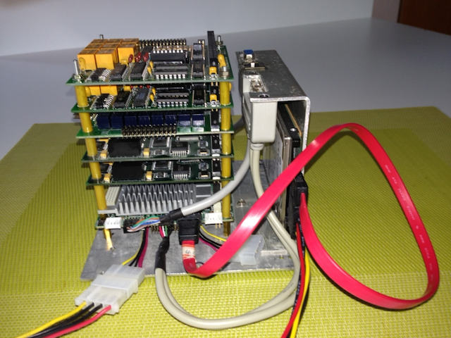
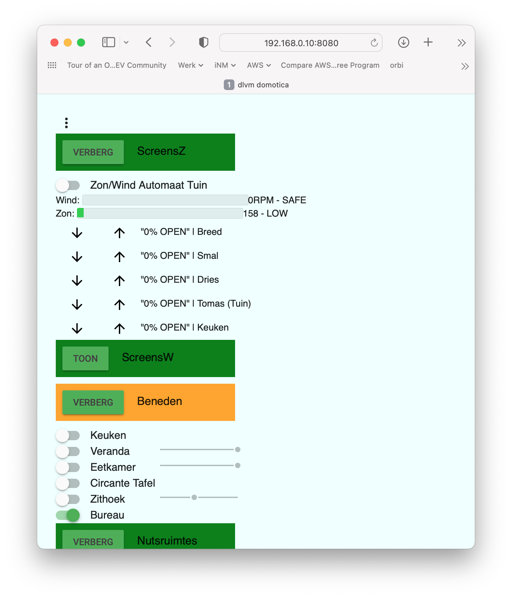
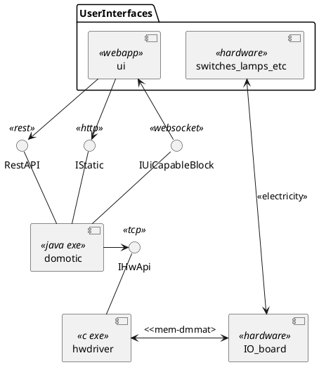
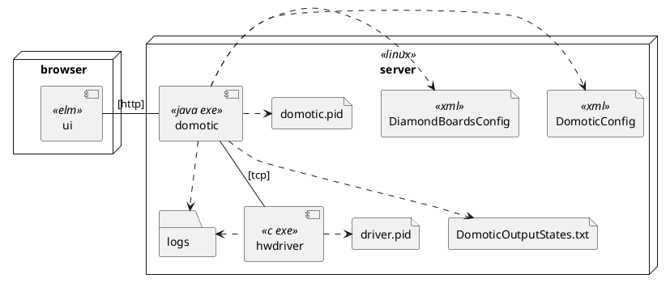
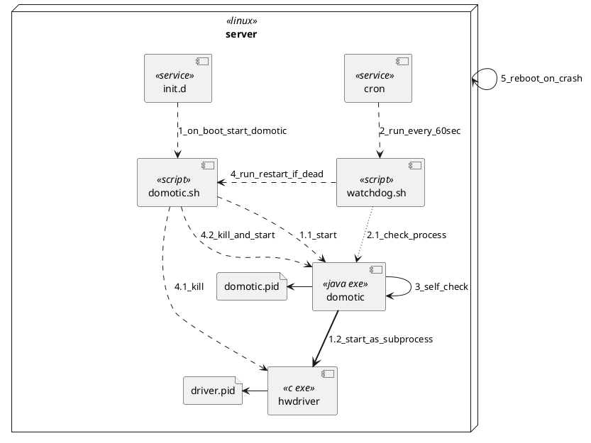
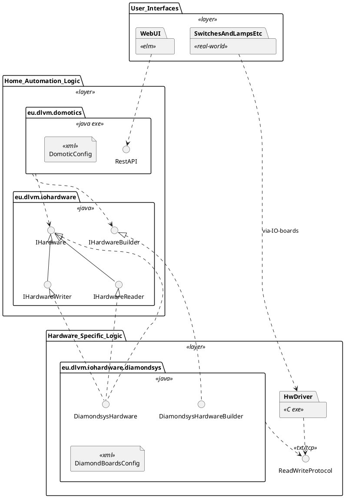
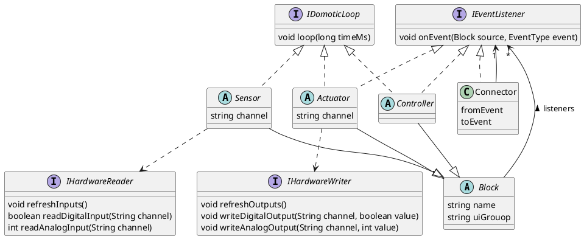
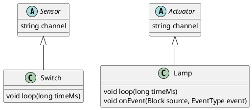
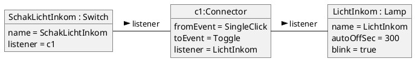
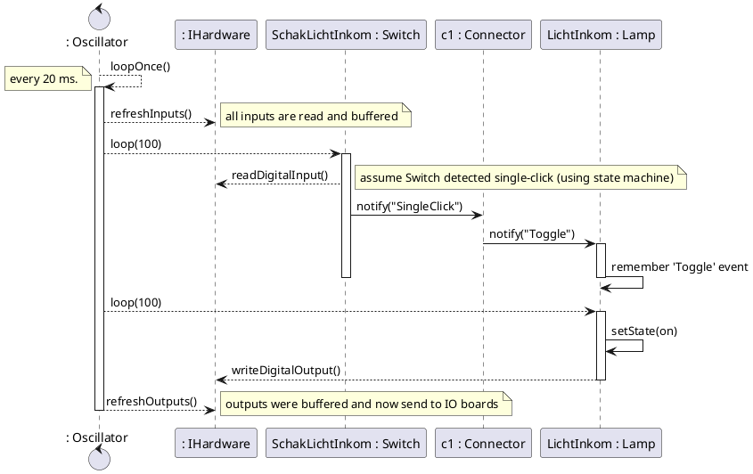

<span style="font-family:Arial; font-size:3em;">DIY Home Automation<br/>Software Architecture Document</span>

> author: dirk@dlvmechanografie.eu<br/>date: 8/6/2022


**Table of Contents**

- [1. Introduction](#1-introduction)
- [2. Context](#2-context)
- [3. Architectural Drivers (aka Architectural Significant Requirements)](#3-architectural-drivers-aka-architectural-significant-requirements)
- [4. Solution Architecture](#4-solution-architecture)
  - [4.1. Functional View](#41-functional-view)
    - [4.1.1. Model](#411-model)
    - [4.1.2. Interfaces](#412-interfaces)
    - [4.1.3. Rationale & Alternatives](#413-rationale--alternatives)
  - [4.2. Deployment View](#42-deployment-view)
  - [4.3. Availability & Reliability Perspective](#43-availability--reliability-perspective)
    - [4.3.1.  Model](#431--model)
    - [4.3.2. Rationale](#432-rationale)
    - [4.3.3. Calculations](#433-calculations)
  - [4.4. Development View](#44-development-view)
    - [4.4.1. Modules and Layers](#441-modules-and-layers)
    - [4.4.2. Modules related to Configuration and Execution](#442-modules-related-to-configuration-and-execution)
    - [4.4.3. Simple Example](#443-simple-example)
    - [4.4.4. Alternatives for Execution](#444-alternatives-for-execution)
- [5. Architectural Evaluation & Risks](#5-architectural-evaluation--risks)
  - [5.1. Evaluation](#51-evaluation)
  - [5.2. Risks & Mitigation](#52-risks--mitigation)
- [6. End of Document](#6-end-of-document)

# 1. Introduction

This document describes the context, architectural drivers and design of the home automation system.

Its purpose is to:
- List the main requirements that drive the architecture.
- Explain the structure of the system without having to dive in thousands of lines of code. Great for newbees, as well to the author who tends to forget stuff easily.
- Evaluate if and how the design realizes the requirements (drivers), and any alternatives considered.


# 2. Context

The system is a **Home Automation** system built up from common hardware and custom software. 

The system only handles lights and sun screens, not wall sockets or heating or other fancy stuff. 

The primary goal of this system is for me, as a software engineer, to keep my skills up to date, have some fun and sometimes help convince recruiters to hire me ;-) There are much more feature rich open-source systems available elsewhere.

Here is a view of the hardware I currently use.



At the bottom is an Advantech Atom CPU based motherboard, on top of which stack multiple I/O boards from Diamond Systems. The I/O boards provide digital and analog inputs and outputs, which connect to switches, lamps, screens, fans, voltage controlled dimmers or a weather station that measures wind and light.

This hardware is connected to many many wires, relays, dimmers, power supplies in below closet.


At the far left, left from the CPU and stacked I/O boards, there is an extra PCB with extra buffers and analog in/out amplifiers. Reason is that this was cheaper than buying extra Diamond Boards.

Finally, we have two Human User Interfaces:
1. the main one being wall switches, lamps and so on, and 
2. a web based UI shown below.
<div>

</div>
Some historical evolutions (and more photos) are in [History](./HISTORY.md).


# 3. Architectural Drivers (aka Architectural Significant Requirements)

This lists these home automation requirements that drive the design.

| ID | Category | Driver | 
| -- | --- | --- |
| Layout Config | Configurability | Layout Configurability: Easy to configure when sensors or actuators are added, removed or changed. For example, assigning a switch to another lamp, changing name of a lamp, change the sun sensitivity for automatic screens, change when lights outside go on and off automatically. |
| UI Config | Configurable | A UI that is generated from the configuration. So no coding work whenever the configuration (see 1) changes. |
| BugFree | Reliability | Since I'm sometimes traveling and my wife or children lack knowledge on the system, it must have no bugs. |
| Safe | Safety | Software must not destroy, short-circuit or overheat hardware like screen motors or lamps. Additional safeguards must avoid this. |
| Available | Availability | 99,99% uptime over 1 week, so 1.01 unavailability minutes a week. |
| HwChange | Flexibility | Other hardware could be chosen than the current one, and that should have max. 1 man-month work impact. |
| Explore | Flexibility | A test-bed for new software technologies and a showcase. So some degree of over-engineering is allowed ;-) |


# 4. Solution Architecture

## 4.1. Functional View

### 4.1.1. Model 


Legend:
- rectangle: **component**; a runnable software component, except for `switches_lamps_etc` which is hardware
- arrow: **connector**; communication between components and/or interfaces; arrow direction is from communication-initiator to target
- lollipop: **interface**; optional, explicit interface offered by the component it has a line too

Description of the different components, interfaces and connectors:

| element | description |
|---|---|
| switches_lamps_etc | The classical Human User Interface being switches, light & wind sensors, lamps, screens etc. |
| ui | [ELM](https://elm-lang.org) based UI based WebApp GUI as an alternative to mechanical switches. |
| domotic | Java program that contains all the logic of the domotic system. It has an embedded Jetty HTTP server, see [ServiceServer](../src/main/java/eu/dlvm/domotics/server/ServiceServer.java). |
| IStatic | HTTP endpoint to serve static content, specifically the `ui` front-end. It listens on the root path, e.g. `http://localhost/`. |
| RestAPI | REST API offered by `domotic`, to read domotic state as well as update it. See [RestService](./src/main/java/eu/dlvm/domotics/service/RestService.java) for details. It listens on the `rest` paths, e.g. `http://localhost/rest/`. **Needs rework!** |
| IUiCapableBlock | Websocket connection, sends each state update (lamp, wind, light sensor etc) to registered websocket clients. It is a list of [IUiCapableBlock](../src/main/java/eu/dlvm/domotics/base/IUiCapableBlock.java) informations sent at each state change. |
| hwdriver | C program that talks to the IO boards that in turn connect with switches, lamps etc. This is a very thin component, only executing the simple read/write commands it gets from `domotic` via `HardwareIO` interface onto the `IO Boards` hardware. <br/>Note that this program is Diamond Systems specific.|
| HardwareIO | Custom protocol to read inputs (switches, light sensort etc.) from the IO boards, and write outputs to the IO boards to control lamps, screens, dimmers etc. It is a custom protocol - specific for Diamonds IO boards - that is text based and uses TCP/IP. |
| IO_board | IO Boards from Diamond System Corporation, compatible with PC/104 standard. IO Boards - multiple - have numerous digital inputs and outputs as well as a few analog inputs and outputs. Reading and writing IO goes via direct memory access (hence the supervisor mode of `hwdriver`) according to DMATT protocol. This is detailed in Diamond Systems documentation.<br/>Between the IO Boards and the switches, lamps (via relais or voltage-controlled dimmer) etc. is pure electricity based. | 


### 4.1.2. Interfaces
_Only fragments shown here, just to get the idea._

The interface `RestAPI` gives the current status of all actuators (output devices), and you can change some input. Below is an example of a lamp, when calling `http://hostname/rest/statuses`.
```json
[
    {
        "name": "LichtKeuken",
        "type": "Lamp",
        "description": "Keuken",
        "groupName": "Beneden",
        "groupSeq": 0,
        "status": "OFF",
        "on": false
    }
]
```

For the interface between `domotic` and `hwdriver`, the Diamondsys specific `eu.dlvm.iohardware.diamondsys.messaging.HardwareIO` uses text messages over TCP. For example when `domotic` receives the message `INP_D 0x300 6 - 240`
means that for the board at address 0x300:
- `6`:  digital input channels 1 and 2 are on hence 6, since 110 in binary
- `-`: value of analog channel 0 was not requested, and 
- `240`: analog channel 1 measures 240.

 
### 4.1.3. Rationale & Alternatives

The web UI was written in ELM. An earlier simpler version was written with JQuery and Javascript, but this was really ugly code, difficult to maintain and understand, let alone to extend. Thanks to Frank Piessens I learned about ELM, pure functional and pure fun.

The `hwdriver` is a separate executable because it needs to communicate with the IO boards. That requires memory addressing directly, something that is not possible with Java. Therefore it was written in C. It is kept as small as possible. See also Availability & Robustness perspective. 

## 4.2. Deployment View



Description of the different nodes and components is in below table. Elements already explained are left out.

|element | description |
|---|---|
| server | Ubuntu Linux on an Advantech Atom PC, with PC/104 IO Boards from Diamond Systems. |
| browser | Any browser on the local network, so `192.168.*.*`. |
| DomoticConfig | Defines all inputs, outputs and behaviours of the home automation system. Switches, Lamps, Screens etc., and how the are connected and configured.<br/>It also defines the layout in the UI.|
| DiamondBoardsConfig | Defines how the hardware is configured. See Layered View later, this allows for different hardware to be used without touching the domotic specific code. |
| logs | Both `domotic` and `hwdriver` send logs to this folder. They use `logback` and `log4c` respectively.
| domotic.pid | File containing the PID of the `domotic` program. Used for restarting. |
| driver.pid | File containing the PID of the `hwdriver` program. Used for restarting. |
| DomoticOutputStates.txt | File containing the actual states of the output devices, e.g. whether a certain lamp is on or off. Used when restarting to restore the old state. |


Not described here are the Linux service definition and health check. See [deployment](./deployment/README.md) subfolder for more information. These are also described in the _Availability View_.

It is perfectly possible to have `domotic` and `hwdriver`, each with their respective supporting files, run on different computers.


## 4.3. Availability & Reliability Perspective

### 4.3.1.  Model

In below model a few additional elements appear.

| element | description |
|---|---|
| init.d | Ubuntu 16 service mechanism. |
| domotic.sh | Script to start, stop or restart `domotic` as a service. The start command will automatically be executed at server boot.|
| cron | Linux cron facility. |
| watchdog.sh | Script that checks if `domotic` process still exists, using `domotic.pid`, and restart if needed. |

> Note: Better option may be to use `systemd` as a replacement for `init.d` which can restart services. The original Ubuntu version did not have that facility yet. Replacement is planned.

Legend:
- dashed line: start or kill a process
- dotted line: check a process
- bold plain line: start as a sub-process



| interaction | description |
|---|---|
| 1_on_boot_start_domotic | When the server starts, `init.d` will automatically call `domotic.sh start`. |
| 1.1_start | The domotic system is started. Configuration parameters are in this script! |
| 1.2_start_as_subprocess | `domotic` will start the `hwdriver` as a sub-process. |
| 2_run_every_60sec | `cron` will execute `watchdog.sh` every 60 seconds, passing it the path to `domotic.pid`. |
| 2.1_check_process | `watchdog.sh` checks if the `domotic` process still exists. If so, good, if not, see step 4. |
| 3_self_check | If `loop()` (see Development View) did not execute 3 times, so typically after 60 ms., `domotic` will exit with code 1. This is checked in a separate thread. If this happens the system clearly cannot function anymore, so exiting is good.<br/>Note that if the `hwdriver` is gone or not responding anymore (e.g. memory leaks led to this) then `loop()` is blocked too, so this problem is also detected. |
| 4_run_restart_if_dead | If `watchdog.sh` does not find a running `domotic` anymore it requests a restart via `domotic.sh`. |
| 4.1_kill | To be sure, first the `hwdriver` is killed. |
| 4.2_kill_and_start | Next, again to be sure, `domotic` is killed, and next started.|
| 5_reboot_on_crash | If the Linux server crashes, the server is configured to automatically reboot (CPU board configuration). And back to 1.  |

### 4.3.2. Rationale 

The availability requirement of 99,99% is pretty high. Also, when I'm traveling for work, nobody can really intervene if something goes wrong. Therefore the approach taken is multifold:
1. automatically detect malfunctioning and restart the system
2. make code as robust as possible
3. automated testing - see Testability View (TODO)

The above model shows how malfunctions are detected, and if a failure occurs how this leads to a restart of the system. Note that also the Ubuntu system self-restarts.

> Lesson learned: keep it as simple as possible. When checking malfunctions - lik checking subprocesses, reads and writes between `domotic` and `hwdriver` which I tried - is complex, the overall availability decreases because the checking code does not work properly. Eventually I found out - thanks to logs - what the best way was to detect failure and act upon that. Turned out that if the `loop()` described earlier did not happen anymore, checked via a separate thread, the system needs restarting.

On the 2nd point, make the system reliable, a number of approaches were used:
1. Use a safe language as much as possible (Java/Scala/ELM versus C), and decouple the unsafe part (HwDriver)
2. Make the input/output processing deterministic
  
Regarding safe languages, meaning no direct memory access and other goodies:
- Java & Scala were chosen for `domotic`, due to crash resistance
- C part is kept as small as possible
- ELM is far superior to Javascript in bug avoidance 

As explained in the Functional View the `hwdriver` needs direct memory access, so C was chosen. We use Diamond Systems IO hardware, which comes with a C DMMAT library. So Java needed to access C code, which can be done in a number of ways:
- JNI (Java Native Interface): the C library runs in the `domotic` process space; this gives best performance, but crashes in the C code crash the entire system
- custom protocol on top of TCP: much more robust; also allows for easier development, having the `hwdriver` on the actual hardware but the `domotic` on a Mac talking remotely to the `hwdriver`.

We choose for the latter solution, keeping the `hwdriver` as small as possible. 

The deterministic input/outpu processing is described in Development View (**TODO** separation sensor/controller/actuator and separation event-reactive with loop()).

### 4.3.3. Calculations

Calculations are split in two categories:
1. Failures that do not need intervention of a technician; self-healing
2. Failures that do need a technician (basically the author today - perhaps my youngest son one day)

The first category are the cases described higher, where the system detects a failure and restarts automatically.

The MTTR (Mean Time To Repair) (similar to RTO or Restore Time Objective) consists of:
1. `watchdog.sh` runs every 60 seconds, so 30 sec. on average
2. `watchdog.sh` waits 10 seconds before restarting (_probably to avoid tcp issues_)
3. restarting `domotic` and `hwdriver` takes max. 10 seconds

So 50 seconds on average. With the 99.99% availability requirement this means:
$$ 99.99\% = {MTBF \over (MTBF + MTTR)} = {MTBF \over (MTBF + 50 sec)} $$

Solving this: MTBF = 5.8 days minimal, which should be easily achievable.

> Note: the actual state is written to disk every 5 seconds (default). This is ignored in the calculation - we loose maximally changes from last 5 seconds, which is considered not crucial for users anyway.


The second category, where a technician is involved, typically concerns permanent hardware failures. For example, a hard disk that fails (happened twice already) needs either a few days of work (ordering a new HD takes a few days already). It also occurred that the system just hangs, and a power cycle solved the problem - but this too involves the technician. So let's estimate availability with hardware  and software failures that cannot be repaired automatically.

| component | est. availability | data |
| -- | -- | -- |
| disk | 99.995% | SSD EVO 870 has 1.5e6 hours MTTF and 72 hours estimated to repair (ordering and installing) |
| cpu board | 99.74% | 15 years estimated MTTF and 14 days to order, wait delivery and repair; not it already works over 10 years without issue |
| ubuntu | 99.998% | estimated 1 crash every 6 months, 5 minutes restart|
| domotic-a | 99.99% | estimated; see higher, failure every 5.8 days |
| domotic-b | 99,997% | estimated; system hangs, cannot detect failure and hence not restart; happens once a year, 15 minutes on average to solve (terminal or switch off-on)|

So the overall availability would be:
$$Av = Av_{ubuntu} \times Av_{disk} \times Av_{cpu_board} \times Av_{domotic-a} \times Av_{domotic-b}$$

$$Av = 99.995\% \times 99.74\% \times 99.9985\% \times 99.99\% \times 99.997\% = 99.72%$$

The limiting factor is clearly the CPU board, which can be mitigated by having a spare CPU board.

**TODO actual numbers from logs.**

-----------


## 4.4. Development View

### 4.4.1. Modules and Layers 

There are 3 major layers:
1. User Interfaces - Both the Web App and the physical switches / lamps etc.
2. Home Automation Logic - All Java classes that contains all functional logic and that has the `main()` routine. It is hardware independent. It also defines a collection of interfaces, itself hardware independent, that hardware-dependent logic has to implement 
3. Hardware Specific Logic - When another hardware platform is used than today's Diamond Systems I/O boards then only this layer should be replaced, and the upper two layers not.

Below figure shows these layers and some of the modules relevant to the layers. 

Legend: see UML Class Diagrams, with these specifics:
- &lt;&lt;layer&gt;&gt; - Package defining a layer.
- &lt;&lt;exe&gt;&gt; - Executable, basically contains a `main()` routine.



| element | description |
|---|---|
| eu.dlvm.domotics |  Main java program, the executable. All logic is hardware independent. It offers all its functionality, including UI specific information, via `RestAPI`. The actual configuration of switches, lamps, timers, dimmers etc. and how they should behave is defined in a hardware independent way in `DomoticConfig` XML file. |
| eu.dlvm.iohardware | Imposes a generic interface onto hardware specific logic. Note that these interfaces are still part of the hardware-independent layer. <br/> Interface `IHardware` has an operation to start and stop the hardware, and includes interfaces `IHardwareReader` and `IHardwareWriter` to read inputs and write outputs respectively.<br/> Interface `IHardwareBuilder` is used at initialization to get an instance of `IHardware`. |
| eu.dlvm.iohardware.diamondsys | Java classes `DiamondsysHardware` and `DiamondsysHardwareBuilder`realize the interfaces from `eu.dlvm.iohardware` for Diamond Systems specific boards. It also has an XML configuration file `DiamondBoardsConfig` that links the generic I/O addresses used in the higher layer to specific boards (via memory address) and board-specific input or output numbers.|
| ReadWriteProtocol | This is a description of the text based and TCP/IP based protocol to communicate between the Java code and the HwDriver. It is specified as comments in specific `eu.dlvm.iohardware.diamondsys` classes and in the `HwDriver` code. |
| HwDriver | C based program. See higher for its description. |

> **To Improve**:  `IHardwareWriter` and `IHardwareReader` should not extend `IHardware` but instead should be members of it (delegation).

Suppose another hardware is used than Diamond Systems, what needs to change?
1. Another Java implementation of the interfaces in `eu.dlvm.iohardware`.
2. Depending on the hardware and its driver, another `HwDriver` is needed or perhaps another solution (who knows, that hardware might include a Java driver).
3. Another configuration means replacing `DiamondBoardsConfig`,

That should be it. Often a new kind of hardware might impact the interfaces in `eu.dlvm.iohardware` making them more generic so that they can handle more different types of hardware. But today's separation already makes it more easy.

### 4.4.2. Modules related to Configuration and Execution

The main classes related to a specific configuration of a home automation system, and how it is executed, are depicted below.

> Note: it may be instructive to read this together - back and forth - with the example in the next chapter.



| element | description |
|---|---|
| Block | Supertype that just has a unique name and information for the UI (1). |
| Sensor | Sensors sense input from hardware. They have at least one input channel, sometimes more. They transform simple hardware inputs into higher level events, such as DoubleClick or SingleClick or WindHigh.<br/> Only Sensors can read data from hardware. <br/>Sensors send events to Controllers or directly to Actuators.| 
| Actuator | Actuators actuate output. They have at least one output channel like a switch, or multiple like up/down for screens. <br/>Only Actuators can change outputs of hardware. <br/> Actuators do not send events to other Blocks.
| Controller | Controller typically contain functionally complex logic.<br/>Controllers have no access to hardware.<br/>Controllers send events to  Actuators or other Controllers. |
| IEventListener | Blocks can send events o other Blocks, e.g. when a Switch is pressed (Sensor) it sends an event to a Lamp (Actuator) so it is switched on or off.<br/>For safety event propagation is limited (see previous rows, from Sensor to Controller to Actuator, never reverse) and state changes can only happen in `loop()`|
| Connector | Used between Blocks to convert one event-type into another. Is fully stateless, and very lightweight. <br/>E.g. in earlier Switch/Lamp example a Switch sends `SingleClicked` events and Lamps expect `Toggle` events. So a `Connector` is placed in between to convert this event.
| IDomoticLoop | All Blocks implement the `loop()` function called from `loopOnce()` described later. State changes of a Block, like 'on' or 'off' in an Actuator, must only occur from within a `loop()` function (not from an event). |
| IHardwareReader IHardwareWriter | Sensors and Actuators respectively read from and write to the hardware via an implementation of this interface. This abstracts away the actual hardware used.|

(1) The UI is completely dynamic, as it is built up from information in the configuration files. So no programming required when domotic configuration changes.

Below code is the core driver of the domotic system.

```java
	public synchronized void loopOnce(long currentTime) {
		hw.refreshInputs();
		for (Sensor s : sensors) {
			s.loop(currentTime);
		}
		for (Controller c : controllers) {
			c.loop(currentTime);
		}
		for (Actuator a : actuators) {
			a.loop(currentTime);
		}
		hw.refreshOutputs();

        for (IStateChangedListener uiUpdator : stateChangeListeners)
            uiUpdator.updateUi();
	}

```

This is what happens every 20 ms (configurable):

- `IHardwareIO.refreshInputs()` is called, so that actual hardware inputs are read.
- All Sensors have their `Sensor.loop()` run to process these inputs and update any state machines. State changes may lead to events being sent to Controllers or Actuators that are registered in the Sensor. These Controllers and Actuators must not yet change their state or send events themselves - they just have to 'remember' the event received.
- Next `Controller.loop()` is run on all Controllers. Now it is the time to process any event information received and noted before, in the `loop()`. This may lead to a state change of the Controller, which in turn may lead to an event to another Controller or Actuator - which again just notes the information down sent by the event.
- Finally Actuators have their `Actuator.loop()` executed, so they can update state and if applicable update hardware outputs. To actually update hardware output `IHardwareIO.refreshOutputs()` is called.
- Finally any `IStateChangedListener`'s are called to update the modelstate of connected client UIs. _This is for UI only, not further explained in this document._

The `currentTime` is a parameter passed on to each Block's `loop()` - it is forbidden in any Block to use `System.currentTimeMillis()` to get actual time. The reason for this is automated testing: the time is a parameter that can be manipulated at will, including in testing or - later - replay.

The separation of event notification and handling its' state changes in `loop()` ensures orderly execution of changes in that outputs are only changed when all sensor and intermediate logic has executed. It also helps the time simulation. 

Safety is further improved by separating hardware access for Sensor, Controller and Actuator, and the fact that Sensors cannot be the target of events.

### 4.4.3. Simple Example

Suppose the `DomoticConfig.xml` file contains the following configuration.
```xml
	<switch name="SchakLichtInkom" />
	<lamp name="LichtInkom" desc="Inkom" autoOffSec="300" blink="true">
		<toggle src="SchakLichtInkom" />
	</lamp>
```
Functionally this means:
- There is a switch at the house's entrance hall.
- There is also a lamp, unsurprisingly, that toggles between on and off depdengin on the switch.
- The lamp turns off automatically after 300 seconds - kids forget to switch it off. The lamp will shortly blink before going off, so you can quickly toggle the switch to prevent that - typically you're chatting at the door with your neighbour.

So how does this relate to the structure explained in the previous section? First let's see how Lamp and Switch fit in. Easy - but check also the other elements in previous section that are inherited. I included some of the methods we'll need later.



Concretely the following object diagram translates the configuration. Note the listener link, the Lamp listens on events from the Switch.



Next let's see at execution. Suppose the lamp is Off and a user just clicked the switch.



More complex configurations exist, using multiple inputs or `Controller`s, but this gives the general flow.


### 4.4.4. Alternatives for Execution
A pure reactive approach was first considered, see [Wikipedia's article on Reactive Programming](https://en.wikipedia.org/wiki/Reactive_programming#Change_propagation_algorithms). 

But since we are dealing with real lamps, screen motors and 230V, safety is important. The downsides of Reactive Programming - see "Implementation challenges in reactive programming" in the article - I went for a more hybrid approach:
- Events are still used, but they are just 'noted down' in the receiver.
- Strict separation between `Sensor`, `Controller` and `Actuator`.
- Handling the events is done during `loop()` which is first done for all `Sensor`s, then `Controller`s and only then `Actuator`s.


# 5. Architectural Evaluation & Risks

## 5.1. Evaluation
So how does this design realizes the architectural requirements listed in the beginning of this document?

| Driver | Evaluation |
| --- | --- |
| Layout Config | The DomoticConfig XML file fully describes the layout, and is processed at re-start. See Deployment View and Layering View. |
| UI Config | The DomoticConfig XML file includes the UI configuration. _Not yet described in design._ |
| BugFree | Fully automated regression tests are provided. The ability to simulate time is fundamental here.<br/>Also a sound approach to how events are handled and state changes are separated from the events is fundamental. These concepts are explained in Class View.|
| Safe | Only Actuators can change outputs so the issues is localized in specific code, improving safety by not scattering this functionality around. Further state changes are localized in Actuator's `loop()` and outputs must only change as a consequence of a state change, further localizing this functionality. Lastly in the Actuator's `loop()` a safeguard must be implemented ensuring that an output does not change too often, e.g. max 1 time per second.|
| Available |The domotic and hwdriver processes run as a service, have a health check and a cron job restarts when no heartbeat is detected (not yet described in any view). Also automated tests contribute here.  |
| HW Change | See Layering View. |

## 5.2. Risks & Mitigation

| Risk | Ref | Mitigation |
| -- | -- | -- |
| CPU board broken | Availability Perspective | Accept the lower availability, so 99.72% instead of 99.99%. <br/>The extra cost of buying a spare CPU board is not worth it. | 

# 6. End of Document